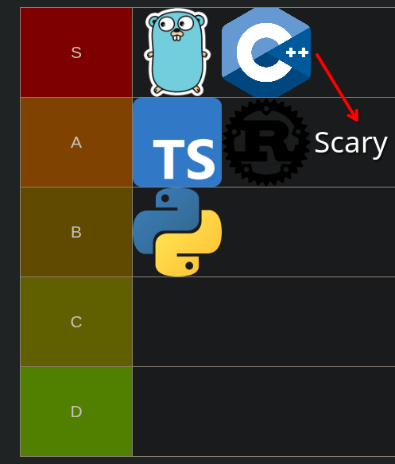

# the case of the decade: battle of the programming languages

**author:** aditya mishra [bit2swaz](https://x.com/bit2swaz)

---

---

the courtroom was heated. like a laptop compiling rust while running 50 chrome tabs type heated.

i sat in the back of **the kernel court**. the judge? **the cpu**. shes cold, binary, and has zero patience for latency.

the case? simple. **"who gets to lead and rule the next decade of code?"**

doors open. here goes.

### the defendant: python
he walks in late. holding an ice venti caramel crunch frappe. wearing a balenciaga hoodie.
his biggest flex? "i literally own AI."

the judge slammed the gavel. "python. you are accused of stealing my cycles. you take 10ms to do what c++ does in 1µs. explain yourself."

python didn’t even look up from his phone.

"chill out, your honor. yeah, i’m slow. what about it? you think people train llms in c++? no. they call *me*."

he pointed to the crowd. packed with ml engineers and data scientists.

"i have the libraries. i have pytorch. i run chatgpt. you want a brain? you want ease of access? you want speed of building? you come to me. i’m not fast, but i’m *rich*."

**verdict:** python is **the celebrity**. he doesn't do the heavy lifting, but definitely signs the checks.

---

### the witness: c++
he's an old war general. has scars from the segfault wars of '98. trusts absolutely no one.
he proudly says "i built the ground you walk on" every 10 minutes.

c++ limped to the stand. glared at python.

"you kids," c++ grumbled. "think youre cool because you have 'garbage collection'? back in my day we managed our own memory. i talk directly to the metal. if i die, the kernel dies. the game engine dies. *the ENTIRE world* dies."

"yeah, okay grandpa," the judge sighed. "but tell me this. are you **user friendly**?"

c++ laughed. "user friendly? i give you a loaded gun and point it at your foot. if you pull the trigger, that’s a *skill issue*. i demand respect."

**verdict:** c++ is **the backbone**. dangerous. scary. absolutely necessary.

---

### the interruption: rust
rust enters the court with a vape in his hand. obsessed with safety. fast as hell but keeps yapping about it.
**flex:** "memory safety is my entire personality."

rust jumped over the railing. "ayo, judge, objection! this entire trial is memory unsafe!"

c++ rolled his eyes. "oh not this again..."

"shutup gramps!" rust yelled. "he lets you leak memory! i’m the new wave. i’m just as fast as him but i have a *borrow checker*. i literally won't let you ship bad code. call it RDD the way i be rizzing the compiler. there's levels to this shit, and none of you even come close to me."

**verdict:** rust is **the try-hard**. insanely talented. technically perfect. clearly, needs to chill.

---

### the reformer: typescript
he used to be a messy party animal (js), but now wears a suit.
his biggest flex? "i run the web. but professionally."

"look," typescript adjusted his tie. "my brother javascript? he was chaos. `[] + [] = ""`? absolute mess. i fixed him."

"i added types. i added structure. i run every startup. i run vs code. you can't escape the web, so you might as well use me so you don't go insane."

typescript is **the standard**. reliable. everywhere. the adult in the room.

---

### the goat: go
he wears a simple t-shirt. headphones on. hasn't said a word yet.
he sits in the back. when asked, he says, "i just ship."

the judge looked at **go**. "and you? what do you do?"

go shrugged. effortless.

"i don't argue about memory like c++ or rust. i don't need 500 dependencies like python. i just work. that's it really."

room went quiet.

"i built docker. i built kubernetes. i run the cloud. while rust is fighting the compiler and c++ is debugging a segfault, i already deployed a microservice to prod. i'm simple. i'm fast. i handle concurrency like breathing oxygen."

go put his headphones back on. "gotta lock in. 50% of the internet just went down and i need to fix it."

---

### the judgment

judge looked at the lineup. the rich kid (python), the soldier (c++), the zoomer (rust), the suit (ts), and the shipper (go).

"the winner depends on what you want," judge announced.

* want a brain? **python**.
* want an engine? **c++**.
* want to flex on twitter? **rust**.
* want to build a saas? **typescript**.
* **want to actually ship systems that scale?**

judge nodded at **go**.

"you know who to call."

*THE END*